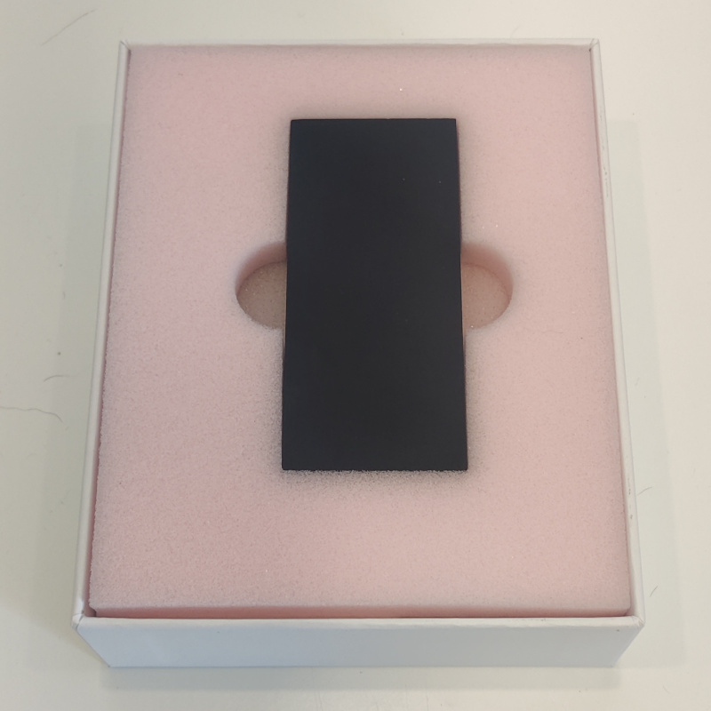
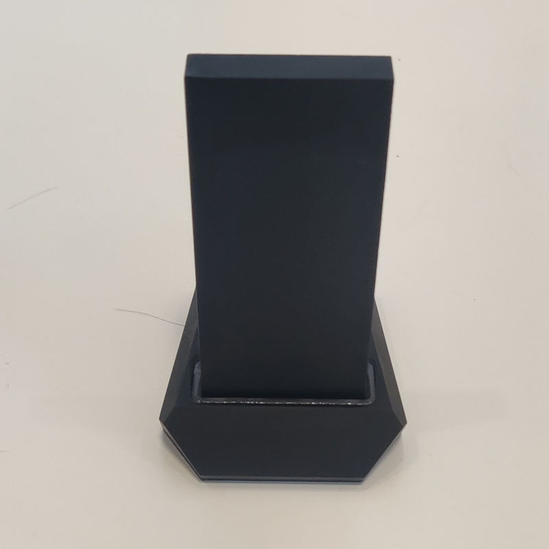
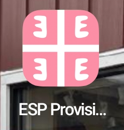
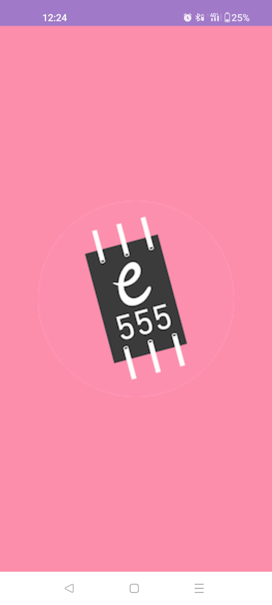
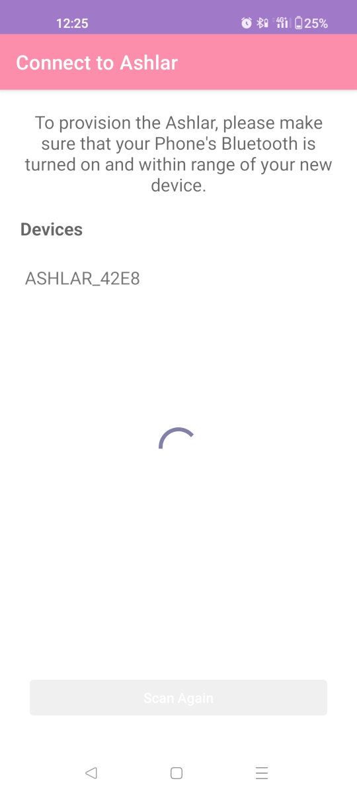
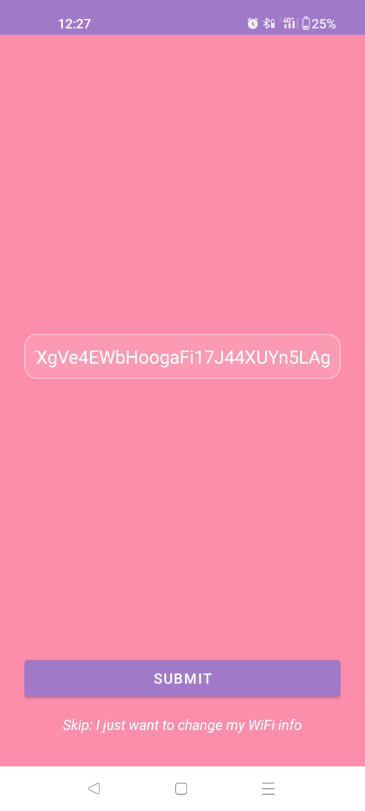
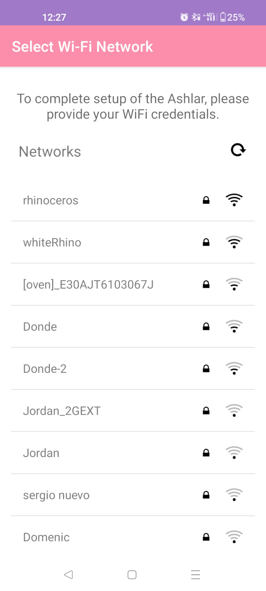
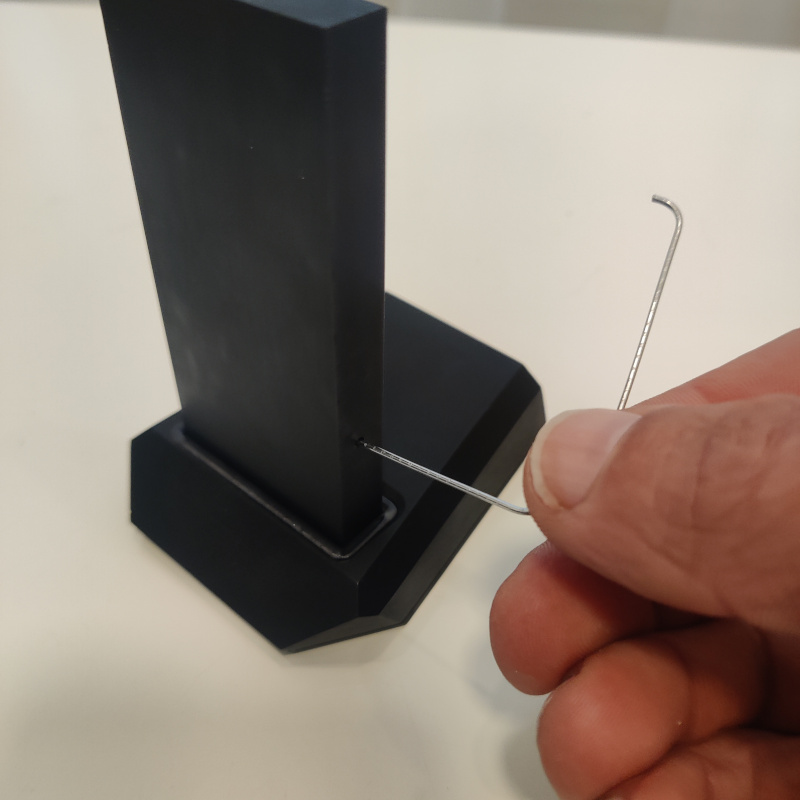

# The Ashlar

The Ashlar is our custom engineered ESP32 mining device. It comes from the factory pre flashed. All you have to do is plug it in, set up the Wifi, and provide your solana address.

## Prerequisites
* An android or apple mobile phone
* A 2.4 GHz Wifi network with internet access.
**NOTE: Many Wifi networks are configured by default to run a 2.4 GHz and a 5 GHz network with the same network name. This may cause failure to identify the network or failure to join the network in some cases. If you have issues connecting to your Wifi network we recommend creating a stand alone 2.4 GHz Wifi network with a unique name. This is a limitation of ESP devices and outside of our control**
* An Ashlar

## Configuration

1. Carefully unbox your Ashlar. **If you purchased more than one, please unbox and configure them one at a time.**

2. Insert the Ashlar into the base. Then plug the base into the wall using the provided power supply and *power only* cable. It will greet you by gently pulsing its LEDs. Say good morning.

3. Download the Entropy app from the Crapple App store or the Google Play Store. If you are one of our beta testers, install the .apk file provided and these [instructions](https://www.lifewire.com/install-apk-on-android-4177185)

4. Create a **NEW** solana wallet that will be used exclusively for this Ashlar

5. Turn on your phone's bluetooth radio

6. Launch the app

7. Tap the Entropy logo to start the provisioning process.

8. Select Ashlar from the list of available devices

9. Enter the address of your new solana wallet and hit submit

10. Select your Wifi network and enter the password when prompted

11. The LEDs will pulse green if the Ashlar connected to your Wifi network successfully. If not, the LEDs will turn red. If the process failed, go back to step 7 and repeat.

## Reprovisioning

You can change the Wifi network your Ashlar is connected. If you have not yet claimed on your new wallet you can also submit a new wallet address.

To start the reprovisioning process, insert a paperclip into the hole on the side of the device. Depress the button and hold it down for 5s. The LEDs will turn blue. They will then turn red, after which you can remove the paperclip. Then follow the provisioning instructions starting at step 5.

